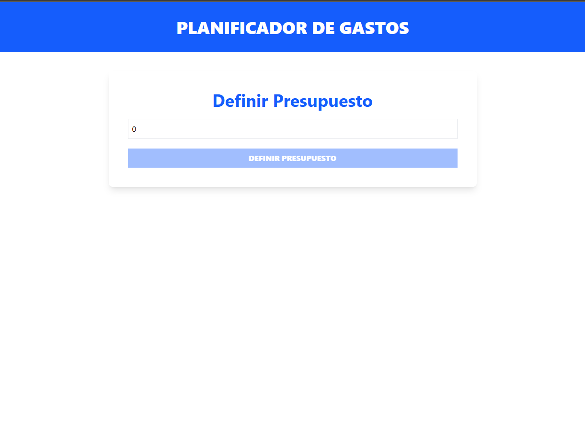
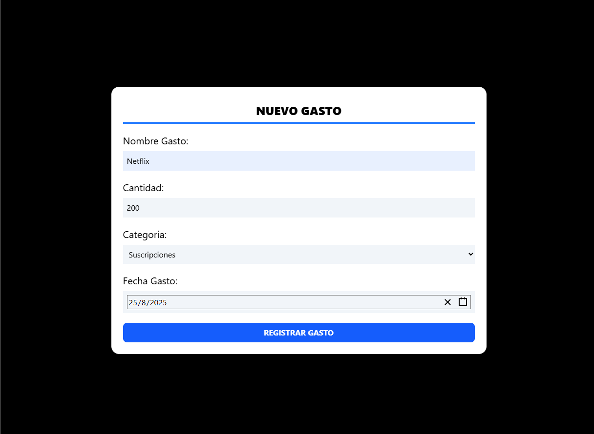
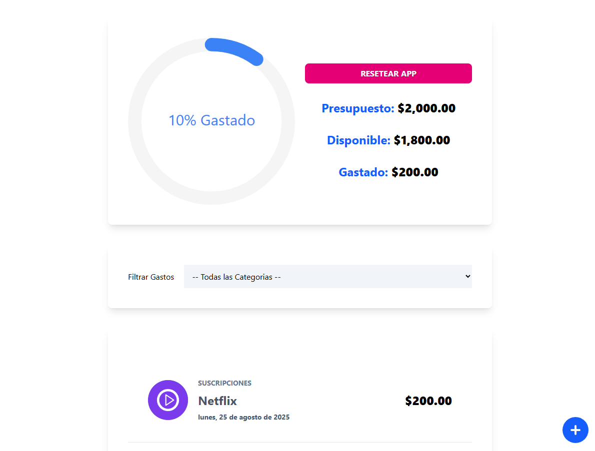

# 🏦 Planificador de Gastos

  
  
  
  
  

Un planificador de gastos en React + TypeScript que permite:

Gestionar presupuesto y gastos

Visualizar gráficas de gastos y saldo restante

Filtrar por categorías

Persistir datos en LocalStorage

🚀 Tecnologías utilizadas

- React

- TypeScript

- Vite

- Tailwind CSS

- React Context + useReducer

- Custom Hook (useBudget) para facilitar el acceso al context

- LocalStorage para persistencia de datos

- Node.js

🎨 Funcionalidades principales

 
Haz clic para ver todas las funcionalidades 👀

- Definir presupuesto inicial al iniciar la app

- Visualización de gastos con gráfica:

	 - Presupuesto inicial

	 - Gastos realizados

	 - Presupuesto restante

- Gestión de gastos:

	 - Agregar gastos mediante modal con formulario

	 - Lista de gastos con acciones:

		 - Deslizar a la derecha → actualizar gasto

		 - Deslizar a la izquierda → eliminar gasto

- Filtrado por categoría usando select

- Resetear la app para reiniciar presupuesto y lista de gastos

- Persistencia de datos en LocalStorage, por lo que los gastos se mantienen aunque cierres o recargues la página

🧩 Custom Hook

Se implementó un hook personalizado (useBudget) para:

- Facilitar el acceso al context de presupuesto y gastos

- Evitar repetir useContext(BudgetContext) en cada componente

Ejemplo de uso:

const { state, dispatch, totalExpenses, remainingBudget } = useBudget();

📦 Instalación y desarrollo
# Clonar el repositorio
git clone https://github.com/tu-usuario/nombre-del-repo.git

# Entrar al directorio del proyecto
cd nombre-del-repo

# Instalar dependencias
npm install

# Iniciar en modo desarrollo
npm run dev

Abrir en el navegador: http://localhost:5173

⚙️ Build para producción
npm run build

Carpeta dist lista para deploy en Netlify, Vercel o cualquier servidor estático

📈 Capturas de pantalla

🔗 Deploy

 Sitio en producción: [Mi app en Netlify](https://controlgastoscontextapi.netlify.app/)

💡 Notas

- Los datos se guardan en LocalStorage, permaneciendo al recargar la página

- Fácil de extender para sincronización con backend o base de datos remota

- Código limpio y modular gracias a Context + Reducer y Custom Hook
